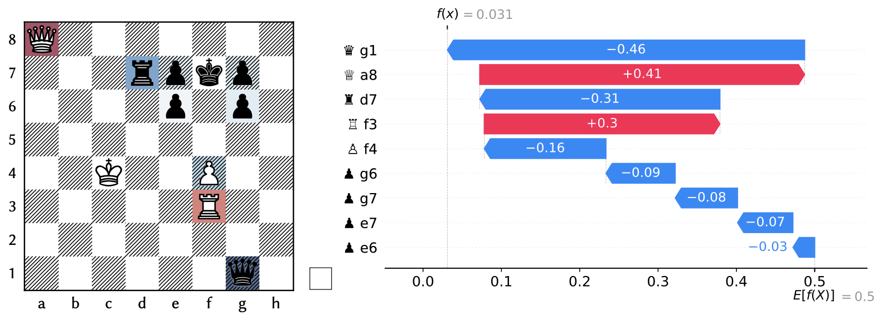

# chessplainer

A Python package for explaining chess positions and moves using SHAP. It provides utilities for analyzing games, visualizing positions, and generating insights for players and developers.



## Installation

1. **Clone the repository:**
   ```bash
   git clone https://github.com/fspinna/chessplainer.git
   cd chessplainer
   ```

2. **Install it:**
   ```bash
   pip install chessplainer
   ```

3. **Install the Stockfish engine:**
   Download from [Stockfish website](https://stockfishchess.org/download/) and follow installation instructions for your OS.

## Usage

Run the example notebook:
  Open [`notebooks/example.ipynb`](notebooks/example.ipynb) in Jupyter Notebook to see usage examples.

